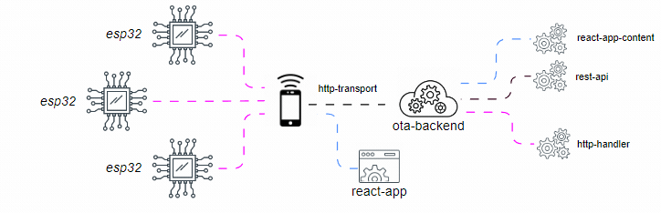
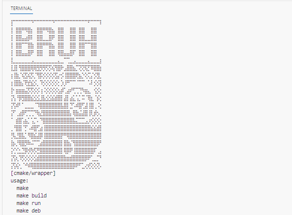

# Over The Air by Backend


### Описание
Проект  представляет собой программное обеспечение на языке C++, которое позволяет разработчикам создавать прототипы взаимодействий с использованием протокола HTTP. 
Для реализации обработки HTTP-запросов в проекте использована библиотека _Corvusoft/restbed_. Эта библиотека обеспечивает удобные средства для работы с HTTP-запросами и обработки данных.

Вы сможете реализовать необходимую функциональность самостоятельно, без использования готовых веб-серверов. Например, вы сможете легко реализовать обновления через воздух. Наш проект предоставляет возможность быстрого прототипирования и полного контроля над функциональностью.

Кроме того,  проект обеспечивает простую интеграцию с другими программными продуктами, если вам понадобится встроенный веб-сервер в приложении. Это позволяет вам свободно связываться с другими системами и использовать их возможности при необходимости. Реализованная функциональность также служит примером работы с библиотекой _restbed_.

Проект также предоставляет простой пример, демонстрирующий обработку CORS (Cross-Origin Resource Sharing). Это позволяет разработчикам ознакомиться с принципами работы CORS при разработке и тестировании веб-приложений.

### Установка и сборка

Для установки и сборки проекта необходимо выполнить следующие шаги:
1. Выгрузите проект на свою локальную машину.
2. Запустите скрипт configure, который автоматически установит все необходимые пакеты для сборки проекта.
3. После успешного выполнения скрипта configure будет сгенерирован makefile. Этот файл предоставляет удобное меню для разработчика и служит оберткой для выполнения сложных команд и задач."

```bash
$ sudo ./configure
$ make build
$ make run
```

### Команды для проверки работоспособности
```
wget http://localhost:8080/app/boot
wget http://localhost:8080/index.html
wget http://localhost:8080/api/post --post-data 'param_1=foo&param_2=bar'
```


### Reference

https://github.com/Corvusoft/restbed
https://github.com/reza-arjmandi/web_api_with_cpp
https://github.com/lywangj/Web_Server_for_Booking_System
https://github.com/Corvusoft/restbed/blob/master/documentation/example/WEB_SOCKET.md